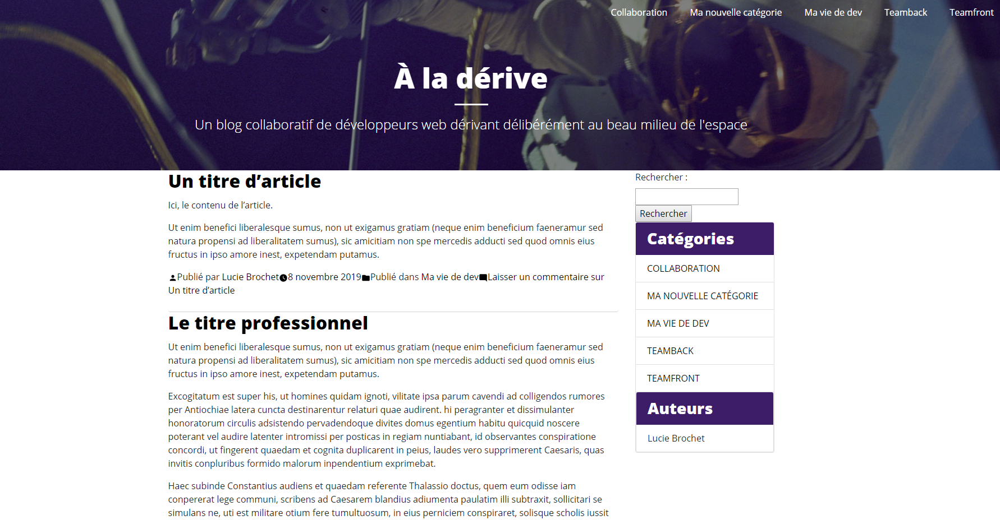
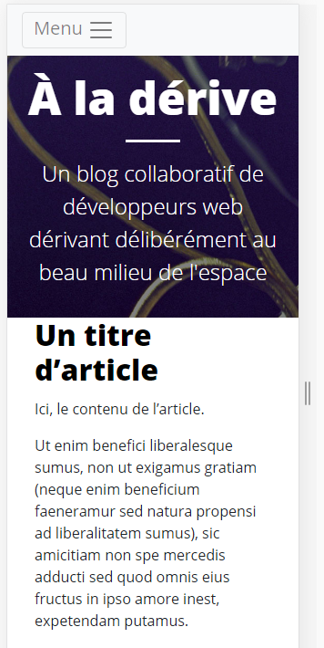
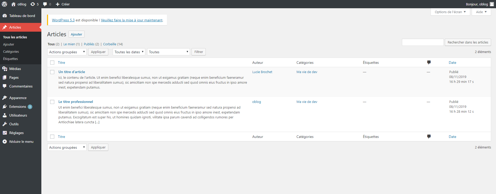

# Parcours de la dernière saison d'O'Clock

>Un parcours est une sorte d'évaluation finale d'une saison chez O'Clock qui dure une matinée, où l'on met en pratique ce que l'on a appris ces derniers jours sur le thème abordé. Ici: Wordpress.

L'intégration HTML et CSS du blog était déjà fournie puisqu'il s'agit d'un exercice que nous avions déjà fait, mais en PHP, donc sans back-office.
L'objectif était avant tout d'utiliser au maximum les fonctionnalités de Wordpress et de créer un thème oBlog.
Nous avions utilisé Wordpress quelques jours avant seulement le parcours pour commencer à le prendre en main. 

Il fallait pouvoir ajouter des articles depuis wordpress, des catégories, ranger ces articles, avoir le nom des auteurs etc... 
Une navigation dynamique et des liens en bas de page. 
De plus, il fallait que le site soit responsive.

En bonus, il était demandé d'ajouter une barre de recherche et une pagination. 
